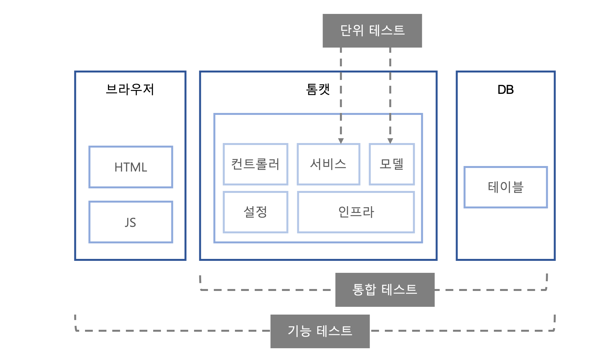

# Chapter 09 "테스트 범위와 종류"

# 테스트 범위

- 테스트 범위에 따른 테스트 종류
- 하나의 기능이 올바르게 동작하기 위해선 코드 단 및 프레임워크 설정에 문제가 없어야 하며,
  HTML, CSS 부터 DB 테이블도 올바르게 생성되어 있어야 한다.

- 테스트의 범위는 테스트의 목적과 수행하는 사람에 따라 달라지며 테스트 범위에 따른 종류는 아래 그림과 같이 3개로 나눠볼 수 있다.

## 기능 테스트와 E2E 테스트

- 기능 테스트(Functional Testing)는 **사용자 입장에서 시스템이 제공하는 기능이 올바르게 동작하는지** 확인한다. 예를 들어 회원 가입 기능이 올바르게 작동하는지 확인하려면 웹 서버, 데이터베이스, 웹 브라우저가 필요하다.
- 기능 테스트는 끝에서 끝까지 올바른지 검사하기 때문에 E2E(End to End) 테스트로도 볼 수 있다. **QA 조직에서 수행하는 테스트가 주로 기능 테스트**이다. 이때 테스트는 시스템이 필요로 하는 **데이터를 입력하고 결과가 올바른지** 확인한다.

## 통합 테스트

- 통합 테스트(Integration Testing)는 **시스템의 각 구성 요소가 올바르게 연동되는지** 확인한다. 기능 테스트가 사용자 입장에서 테스트하는 데 반해 통합 테스트는 **소프트웨어의 코드를 직접 테스트**한다. 모바일 앱을 예로 들면 기능 테스트는 앱을 통해 가입 기능을 테스트한다면 통합 테스트는 서버의 회원 가입 코드를 직접 테스트하는 식이다. 일반적인 웹 애플리케이션은 프레임워크, 라이브러리, 데이터베이스, 구현한 코드가 주요 통합 테스트 대상이다.

## 단위 테스트

- 단위 테스트는 개별 코드나 컴포넌트가 기대한대로 동작하는지 확인한다. 단위 테스트는 **한 클래스나 한 메서드와 같은 작은 범위를 테스트**한다. 일부 의존 대상은 스텁이나 모의 객체 등을 이용해서 대역으로 대체한다.

## 테스트 범위 간 차이

- 통합 테스트를 실행하려면 DB나 캐시 서버와 같은 연동 대상을 구성해야 한다. 기능 테스트를 실행하려면 웹 서버를 구동하거나 모바일 앱을 폰에 설치해야 할 수도 있다. 또한, 통합 테스트나 기능 테스트는 테스트 상황을 만들어내기 위해 많은 노력이 필요하다. 반면에 단위 테스트는 테스트 코드를 빼면 따로 준비할 것이 없다.
- **통합 테스트는 DB 연결, 소켓 통신, 스프링 컨테이너 초기화와 같이 테스트 실행 속도를 느리게 만드는 요인이 많다**. **기능 테스트는 추가로 브라우저나 앱을 구동하고 화면의 흐름에 따라 알맞은 상호 작용**을 해야 한다. 반면에 **단위 테스트는 서버를 구동하거나 DB를 준비할 필요가 없다**. 테스트 대상이 의존하는 기능을 대역으로 처리하면 되므로 테스트 실행 속도가 빠르다.
- 통합 테스트나 기능 테스트로는 상황을 준비하거나 결과 확인이 어렵거나 불가능할 때가 있다. 외**부 시스템과 연동해야 하는 기능**이 특히 그렇다. 이런 경우에는 **단위 테스트와 대역을 조합해서 상황을 만들고 결과를 확인**해야 한다.

## 테스트 범위에 따른 테스트 코드 개수와 시간

- 기능 테스트나 통합 테스트에서 모든 예외 상황을 테스트하면 단위 테스트는 줄어든다. 왜냐면 각 테스트가 다루는 내용이 중복되기 때문이다.
- 테스트 속도는 통합 테스트보다 단위 테스트가 빠르기 때문에 **가능하면 단위 테스트에서 다양한 상황을 다루고, 통합 테스트나 기능 테스트는 주요 상황에 초점을 맞춰야 한다.** 그래야 테스트 실행 시간이 증가해 피드백이 느려지는 것을 방지할 수 있다. 테스트 실행 속도가 느려지면 테스트를 작성하지 않거나 테스트 실행이 생략하는 상황이 벌어진다.

## 외부 연동이 필요한 테스트 예

- DB연동과 HTTP 연동

### 1) 스프링부트와 DB 통합테스트

### 2) WireMock을 이용한 REST 클라이언트 테스트

- WireMockServer는 HTTP 서버를 흉내냄

### 3) 스프링 부트의 내장 서버를 이용한 API 기능 테스트